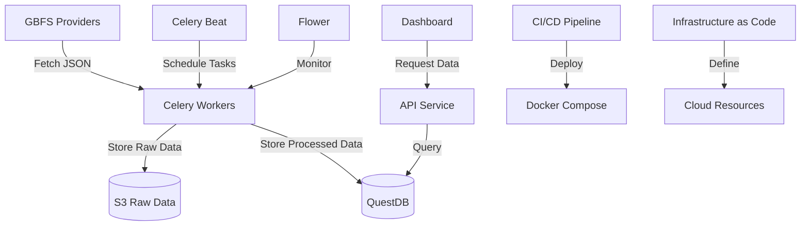

# Welcome to GBFS-mobility-monitoring!

## Introduction

This project implements a monitoring system for General Bikeshare Feed Specification (GBFS) data from multiple providers. It fetches, processes, and visualizes bike-sharing data, offering insights into bike availability across different systems. More explanations can be read from [here](https://www.notion.so/Coming-up-with-a-base-solution-Tech-Stack-8f1f7d76a26c48c587d9eb6ab3c888a0?pvs=21) on notion. 
## Features

-   Fetches data from multiple GBFS providers
-   Processes and stores raw data in S3
-   Stores time series data in QuestDB for efficient querying
-   Provides a RESTful API for data access
-   Offers a web-based dashboard for data visualization
-   Uses Celery for task scheduling and parallel processing
-   Monitors task execution with Celery-Flower
-   Containerized with Docker for easy deployment

## Architecture

The system consists of the following components:

-   Backend (Flask)
-   Frontend (HTML, CSS, JS)
-   Celery workers and beat scheduler
-   Redis (message broker for Celery)
-   QuestDB (time series database)
-   Flower (for Celery task monitoring)
-   Docker for orchestrating everything together

## Prerequisites

-   Docker and Docker Compose
-   AWS account with S3 access & Lambda with VPC configured, and EC2

## Setup

1.  Clone the repository:
    
    `git clone https://github.com/yourusername/gbfs-monitor.git cd gbfs-monitor`
    
2.  I've prepared an example `.env`file in the repo, so supplying all of them should get the job done
3. There's a `lambda_function.py`inside lambda_function folder,  deploy it on AWS lambda with VPC configured. And add an trigger S3 source.        
5.  Build and start the Docker containers:
    
    `docker-compose up --build`
    

## Usage

After starting the containers, you can access the following services:

-   Frontend Dashboard: [http://localhost:3000](http://localhost:3000)
-   Flower (Celery Monitoring): [http://localhost:5555](http://localhost:5555)
-   QuestDB Web Console: [http://localhost:9000](http://localhost:9000)

## Development

To add a new GBFS provider:

1.  Add the provider details to the `PROVIDERS` list in `backend/tasks/gbfs_tasks.py`
2.  Implement any provider-specific data processing logic in the `process_data` function

## Testing

(Add information about running tests when implemented)

## Contributing

Contributions are welcome! Please feel free to submit a Pull Request.

## License

This project is licensed under the MIT License - see the [LICENSE](LICENSE) file for details.

## Acknowledgements

-   [GBFS](https://github.com/NABSA/gbfs) for the bikeshare data specification
-   All the open-source libraries and tools used in this project

## Low Level Diagram of how system is designed

## Future Improvements
1. Make the GBFS publishers configurable.
2. Implement CI/CD 
3. Make the frontend more UI/UX friendly
4. Distribute Celery workers using some kind of MQ protocol
5. Make the Backend Requirement more clear
6. Implement the IaC for when adding more GBFS data provider
7. Calculate the hyperparameter for data ingestion
8. So on...
